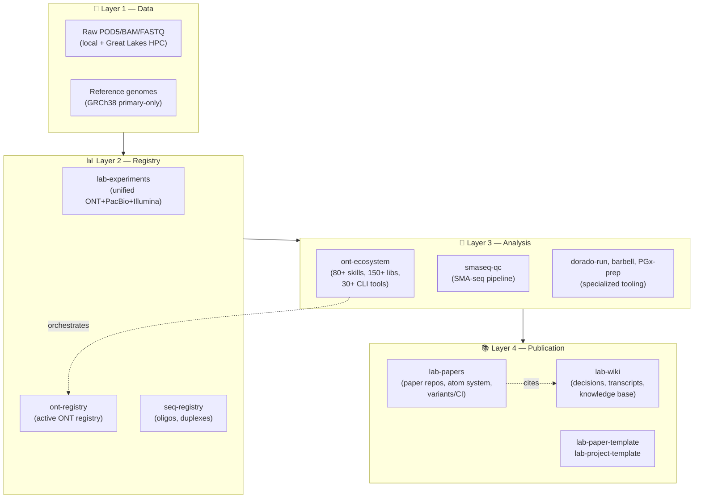

# Single Molecule Sequencing

**Long-read genomics, pharmacogenomics, and methods development at the [Athey Lab](https://atheylab.org), University of Michigan**

---

## 🔬 What we do

We build **single-molecule, long-read sequencing methods** — Oxford Nanopore Technologies (ONT) and PacBio HiFi — to attack genomic problems that short-read sequencing cannot solve cleanly: structural variation in pharmacogenes (CYP2D6 / CYP2D7 / CYP2D8P), ssDNA size distribution at single-base resolution, repeat expansions, methylation aging clocks, and Cas9-targeted enrichment QC.

Our codebase is organized as a **four-tier infrastructure stack** (data → registry → analysis → publication) that lets every published claim trace back to raw reads through a versioned, reproducible pipeline. The org hosts 85 repositories (12 public · 63 private · 10 archived) covering ~17 active manuscripts, ~14 project shells, and the analysis frameworks they share.

## 🚀 Quick links — dashboards & live sites

- **[🌐 Athey Lab Website](https://single-molecule-sequencing.github.io/AtheyLab-Website/)** — Public-facing lab homepage: people, publications, news.
- **[📚 SMS Textbook (Web Edition)](https://single-molecule-sequencing.github.io/sms-textbook-web/)** — 8-volume Quarto book on Single-Molecule Sequencing for Pharmacogenomics — 349 chapters, fully searchable.
- **[🧬 ont-ecosystem Docs](https://single-molecule-sequencing.github.io/ont-ecosystem/)** — Skill catalog and CLI reference for the lab's primary analysis framework (153 lib modules, 80+ skills).
- **[🧪 Sample-Sheet Generator](https://single-molecule-sequencing.github.io/sss/)** — Browser-based wet-lab sample-sheet builder for ONT runs.
- **[🏠 Org Landing](https://single-molecule-sequencing.github.io/)** — Org-level Pages site with live pulse, paper portfolio, and project knowledge graph.

## 🏗️ Lab infrastructure stack

The four-tier stack lets every paper trace its claims back to raw reads
through a registry and a reproducible analysis pipeline.

## 📦 Repositories

Every active and archived repo in the org, grouped by purpose. Stamps reflect last `git push` time.

🧭 Marker legend

| Marker | Meaning |
|---|---|
| 🟢 | Active this week |
| 🟡 | Active this month |
| 🟠 | Active in the last 6 months |
| ⚪ | Quiet (>6 months) |
| 🌍 public | Open to the world |
| 🔒 private | Members of `Single-Molecule-Sequencing` only |
| 🏛️ internal | UM enterprise-internal |
| 🔗 site | Has a live GitHub Pages or external homepage |

### 🏗️ Core infrastructure

The substrate everything else depends on — registries, analysis frameworks, paper-build tooling, ambient lab-context runtime.

| Repo | Description | Meta |
|---|---|---|
| 🟢 [`lab-papers`](https://github.com/Single-Molecule-Sequencing/lab-papers) | Lab-wide infrastructure for manuscripts: validated reference library, shared LaTeX macros, matplotlib conventions, reusable CI, submission checklists, and Claude skills. | 🔒 private · `Python` |
| 🟢 [`lab-system`](https://github.com/Single-Molecule-Sequencing/lab-system) | Ambient lab-context runtime: locations manifest + MCP server + workspace launcher | 🔒 private · `Python` |
| 🟢 [`ont-ecosystem`](https://github.com/Single-Molecule-Sequencing/ont-ecosystem) · [🔗 site](https://single-molecule-sequencing.github.io/ont-ecosystem/) | Oxford Nanopore experiment management with provenance tracking | 🔒 private · `Python` |
| 🟢 [`lab-wiki`](https://github.com/Single-Molecule-Sequencing/lab-wiki) | Athey Lab living knowledge base — LLM-maintained wiki | 🔒 private · `Python` |
| 🟢 [`SMS_infrastructure`](https://github.com/Single-Molecule-Sequencing/SMS_infrastructure) | Core infrastructure: schemas, validation, templates, and automation for SMS Lab | 🔒 private · `HTML` |
| 🟢 [`lab-onboarding`](https://github.com/Single-Molecule-Sequencing/lab-onboarding) | End-to-end onboarding for new Athey Lab members with GitHub Copilot — clones the 4-layer lab infrastructure (ont-ecosystem, lab-system, lab-papers, lab-wiki), installs Copilot CLI, wires MCP, validates. | 🔒 private · `Shell` |
| 🟢 [`lab-experiments`](https://github.com/Single-Molecule-Sequencing/lab-experiments) | Unified event-sourced experiment registry (ONT + PacBio + Illumina). v1 spec in docs/superpowers/specs/. | 🔒 private · `Python` |
| 🟢 [`dev-env-setup`](https://github.com/Single-Molecule-Sequencing/dev-env-setup) | Automated installation of bioinformatics and AI development tools | 🔒 private · `Shell` |
| 🟢 [`lab-context`](https://github.com/Single-Molecule-Sequencing/lab-context) | Earlier ambient-context experiment, partially superseded by lab-system. Pending reconciliation. | 🔒 private · `Python` |
| 🟢 [`lab-agent`](https://github.com/Single-Molecule-Sequencing/lab-agent) | Private Chief-of-Staff Agent for gregfar@umich.edu. Reads lab-papers (public) as source; acts on email/calendar/drive/wiki signals; drafts rec letters, paper edits, meeting follow-ups. Every output is a draft — zero auto-send. | 🔒 private · `Python` |
| 🟢 [`seq-registry`](https://github.com/Single-Molecule-Sequencing/seq-registry) | Lab sequence registry: store, query, and analyse DNA/RNA oligos and duplexes | 🔒 private · `Python` |
| 🟡 [`ont-registry`](https://github.com/Single-Molecule-Sequencing/ont-registry) | Centralized registry for Oxford Nanopore sequencing experiments | 🔒 private · `Python` |

### 📝 Manuscripts in progress

One repo per paper. Each follows the lab atom-system convention (variants/, atoms/, content/, CI auto-builds PDFs on push).

| Repo | Description | Meta |
|---|---|---|
| 🟢 [`end-reason-paper`](https://github.com/Single-Molecule-Sequencing/end-reason-paper) | Canonical paper repo: End-reason QC for Oxford Nanopore adaptive sampling (Scientific Data target). Replaces archived End_Reason_Manuscript + endreason_manuscript + paper-end-reason. | 🔒 private · `Python` |
| 🟢 [`paper-smaseq-basecaller-finetuning`](https://github.com/Single-Molecule-Sequencing/paper-smaseq-basecaller-finetuning) | Machine-learning methods manuscript for SMA-seq label-driven basecaller fine-tuning | 🔒 private · `TeX` |
| 🟢 [`paper-proficiency-testing-plasmids`](https://github.com/Single-Molecule-Sequencing/paper-proficiency-testing-plasmids) | Plasmid-standard proficiency-testing paper (CYP2D6 standards for SMA-seq calibration). | 🔒 private · `TeX` |
| 🟢 [`paper-plasmid-standards-proof`](https://github.com/Single-Molecule-Sequencing/paper-plasmid-standards-proof) | Empirical proof that plasmid standards anchor SMA-seq error-rate calibration. | 🔒 private · `TeX` |
| 🟢 [`paper-cyp2d6-breast-cancer-targeted`](https://github.com/Single-Molecule-Sequencing/paper-cyp2d6-breast-cancer-targeted) | CYP2D6 targeted long-read sequencing in breast-cancer pharmacogenomics. | 🔒 private · `TeX` |
| 🟢 [`paper-clc-library-prep`](https://github.com/Single-Molecule-Sequencing/paper-clc-library-prep) | Paper repository for the CLC one-pot precision library preparation manuscript | 🔒 private · `TeX` |
| 🟢 [`paper-bsl2-targeted-long-read`](https://github.com/Single-Molecule-Sequencing/paper-bsl2-targeted-long-read) | Long-read targeted sequencing protocol for BSL2-class clinical samples. | 🔒 private · `TeX` |
| 🟢 [`cas9-clc-ce-methods`](https://github.com/Single-Molecule-Sequencing/cas9-clc-ce-methods) | Measurement-guided methods paper for optimizing Cas9 targeted long-read sequencing with CLC-CE, ligation assays, and empirical ONT/PacBio read models | 🔒 private · `TeX` |
| 🟢 [`SMAseq_paper`](https://github.com/Single-Molecule-Sequencing/SMAseq_paper) | Manuscript workspace: Empirical error rate determination in single-molecule sequencing using sequence-defined DNA standards | 🔒 private · `Python` |
| 🟢 [`paper-pgx-adaptive-sampling-v2`](https://github.com/Single-Molecule-Sequencing/paper-pgx-adaptive-sampling-v2) | CYP2D6 diplotype resolution via ONT adaptive sampling (regen from template — content TK) | 🔒 private · `TeX` |
| 🟢 [`Wolfe_Thesis_final`](https://github.com/Single-Molecule-Sequencing/Wolfe_Thesis_final) | Monica J. Wolfe PhD dissertation (final version) — single-molecule long-read sequencing for complex loci. | 🔒 private · `TeX` |
| 🟢 [`sg-ncc2003-manuscript`](https://github.com/Single-Molecule-Sequencing/sg-ncc2003-manuscript) | Long-read sequencing vs PharmacoFocus array CYP2D6 genotyping for tamoxifen pharmacogenomics in a Singapore breast cancer cohort | 🔒 private · `Python` |
| 🟢 [`paper-ssdna-size-distribution`](https://github.com/Single-Molecule-Sequencing/paper-ssdna-size-distribution) | Single-Base-Pair Resolution ssDNA Size Distribution Analysis of Plasmid Standards and Cas9-Containing Cleavage Sites | 🔒 private · `TeX` |
| 🟢 [`paper-ce-cas9-cleavage-methods`](https://github.com/Single-Molecule-Sequencing/paper-ce-cas9-cleavage-methods) | Capillary Electrophoresis Methods for Quantitative Characterization of Cas9 Cleavage Products | 🔒 private · `TeX` |
| 🟢 [`paper-ont-invisible-ends`](https://github.com/Single-Molecule-Sequencing/paper-ont-invisible-ends) | Invisible Ends: ONT reads systematically miss the terminal 10-20 nt at both ends, demonstrated via paired phosphorylated/unphosphorylated CLC SMA-seq adapters | 🔒 private · `TeX` |
| 🟢 [`paper-singapore-cohort`](https://github.com/Single-Molecule-Sequencing/paper-singapore-cohort) | Singapore breast cancer cohort pharmacogenomics study | 🔒 private · `HTML` |
| 🟢 [`golden-gate-methods`](https://github.com/Single-Molecule-Sequencing/golden-gate-methods) | Type-IIS Golden Gate cloning methods paper (companion to /golden-gate-assembly skill). | 🔒 private · `Python` |

### 🧪 Active project workspaces

Project-coordination shells (`.project/` + `CLAUDE.md` pattern). Each wraps wet-lab + dry-lab work toward a single research question.

| Repo | Description | Meta |
|---|---|---|
| 🟢 [`telomere-sequencing`](https://github.com/Single-Molecule-Sequencing/telomere-sequencing) | Long-Read Telomere Sequencing for TMM Profiling in Liposarcoma — RCC/CSI Grant #14884 | 🔒 private · `Python` |
| 🟢 [`cas9-targeted-sequencing`](https://github.com/Single-Molecule-Sequencing/cas9-targeted-sequencing) | PacBio Cas9-enriched CYP2D6 targeted sequencing project; seeded from Yisang Kim thesis | 🔒 private · `Python` |
| 🟢 [`longevity-platform-grant`](https://github.com/Single-Molecule-Sequencing/longevity-platform-grant) | Multi-PI longevity grant project: 4-axis long-read sequencing platform (methylation aging clock, somatic mosaicism, PGx of aging, mtDNA heteroplasmy). 14+ PDF variants for R01/R21/NIA/U19/Astera/Impetus/Hevolution/NSF/AFAR/Hillblom/CPRIT | 🌍 public · `Python` |
| 🟢 [`golden-gate`](https://github.com/Single-Molecule-Sequencing/golden-gate) | Lab project coordination shell — see .project/ + CLAUDE.md | 🔒 private · `Python` |
| 🟢 [`single-read-single-cell-diplotyping`](https://github.com/Single-Molecule-Sequencing/single-read-single-cell-diplotyping) | Single Read Single Cell Diplotyping project workspace | 🔒 private · `Python` |
| 🟢 [`adaptive-sampling`](https://github.com/Single-Molecule-Sequencing/adaptive-sampling) | Lab project coordination shell — see .project/ + CLAUDE.md | 🔒 private · `Python` |
| 🟢 [`smaseq`](https://github.com/Single-Molecule-Sequencing/smaseq) | Lab project coordination shell — see .project/ + CLAUDE.md | 🔒 private · `Python` |
| 🟢 [`longevity-epigenetics`](https://github.com/Single-Molecule-Sequencing/longevity-epigenetics) | Working repo for the Kunkel/Athey/Kheterpal/Runge longevity-epigenetics proposal (Ellison/Oracle target). Original draft + per-axis brainstorm + revised aims sketch. | 🔒 private · `TeX` |
| 🟢 [`programmable-nuclease-activity`](https://github.com/Single-Molecule-Sequencing/programmable-nuclease-activity) · [🔗 site](https://redesigned-adventure-r32rw74.pages.github.io/) | Lab project coordination shell — see .project/ + CLAUDE.md | 🔒 private · `Python` |
| 🟢 [`fine-tuning`](https://github.com/Single-Molecule-Sequencing/fine-tuning) | Lab project coordination shell — see .project/ + CLAUDE.md | 🔒 private · `Python` |
| 🟢 [`lab-math`](https://github.com/Single-Molecule-Sequencing/lab-math) | Lab project coordination shell — see .project/ + CLAUDE.md | 🔒 private · `Python` |
| 🟡 [`CYP2D7-Level2-Plasmid-Analysis`](https://github.com/Single-Molecule-Sequencing/CYP2D7-Level2-Plasmid-Analysis) | Per-barcode plasmid assembly + classification of CYP2D7 Level-2 Golden Gate constructs from ONT R10.4 rapid-barcoded sequencing run FBD64710 (April 2026). | 🔒 private · `HTML` |
| 🟡 [`pharmvar-pangenome-pipeline`](https://github.com/Single-Molecule-Sequencing/pharmvar-pangenome-pipeline) | Pangenome-aware variant resolution against the PharmVar haplotype set. | 🔒 private · `Python` |
| 🟡 [`pacbio-cas9-walkthrough`](https://github.com/Single-Molecule-Sequencing/pacbio-cas9-walkthrough) | Collaborator-facing walkthrough of the Athey Lab PacBio Cas9-targeted sequencing pipeline (HiFi BAM -> pbmm2 -> /cas9-enrichment -> /cas9-panel-eval v1.6+v1.7). | 🔒 private · `Python` |

### 🔧 Wet-lab and analysis tooling

Specialized utilities — basecallers, demultiplexers, sample-sheet generators, reference builders, fragment viewers.

| Repo | Description | Meta |
|---|---|---|
| 🟢 [`dorado-run`](https://github.com/Single-Molecule-Sequencing/dorado-run) | ONT Dorado basecaller Orchestration Pipeline | 🌍 public · `Python` |
| 🟢 [`fragment-viewer`](https://github.com/Single-Molecule-Sequencing/fragment-viewer) | Interactive CE viewer + Cas9 cut-product predictor for the Athey lab fluorescent-adapter fragment analysis assay | 🔒 private · `JavaScript` |
| 🟢 [`Reference_Fasta_Generator`](https://github.com/Single-Molecule-Sequencing/Reference_Fasta_Generator) | Creates reference fasta files for sequencing | 🏛️ internal · `HTML` |
| 🟢 [`ONT-SMA-seq`](https://github.com/Single-Molecule-Sequencing/ONT-SMA-seq) | The SMA-seq workflow for Oxford Nanopore Technology, in pure Python and SQLite database. | 🌍 public · `Python` |
| 🟢 [`SMS`](https://github.com/Single-Molecule-Sequencing/SMS) | Lab notebooks: cross-cutting SMS exploration. | 🏛️ internal · `Jupyter Notebook` |
| 🟢 [`EndReason`](https://github.com/Single-Molecule-Sequencing/EndReason) | Notebooks: end-reason analysis exploration. | 🏛️ internal · `Jupyter Notebook` |
| 🟢 [`Error-Rate-SMS`](https://github.com/Single-Molecule-Sequencing/Error-Rate-SMS) | Notebooks: error-rate determination from sequence-defined standards. | 🔒 private · `Jupyter Notebook` |
| 🟢 [`End_Reason_nf`](https://github.com/Single-Molecule-Sequencing/End_Reason_nf) | Nextflow pipeline implementing the end-reason QC workflow. | 🌍 public · `Nextflow` |
| 🟢 [`smaseq-qc`](https://github.com/Single-Molecule-Sequencing/smaseq-qc) | SMA-seq QC Python package: alignment, visualization, Golden Gate pipeline, HPC runner | 🔒 private · `Python` |
| 🟢 [`sss`](https://github.com/Single-Molecule-Sequencing/sss) · [🔗 site](https://single-molecule-sequencing.github.io/sss/) | Sequencing sample sheet generator for wet lab | 🌍 public · `HTML` |
| 🟡 [`sms-pipeline`](https://github.com/Single-Molecule-Sequencing/sms-pipeline) | Computational pipeline for signal processing, segmentation, and basecalling | 🔒 private · `Shell` |
| 🟡 [`sma-seq-workspace`](https://github.com/Single-Molecule-Sequencing/sma-seq-workspace) | SMA-seq analysis workspace: CLC demux, BAM subsampling, IGV reports, reference sequences | 🔒 private · `Python` |
| 🟠 [`SMA_Seq_Figures`](https://github.com/Single-Molecule-Sequencing/SMA_Seq_Figures) | Graphs and Visualization from ONT SMA Seq DB files | 🏛️ internal · `Python` |
| 🟠 [`CypScope-prep`](https://github.com/Single-Molecule-Sequencing/CypScope-prep) | Preparatory FastQ extraction and alignment on per-sample BAM files for CypScope | 🌍 public · `Python` |
| 🟠 [`barbell`](https://github.com/Single-Molecule-Sequencing/barbell) | Extremely fast and accurate Nanopore demultiplexing | 🌍 public · `Rust` |
| 🟠 [`dorado-bench`](https://github.com/Single-Molecule-Sequencing/dorado-bench) | A benchmarking effort of various doraro models for the SMS pipeline | 🌍 public · `Python` |
| 🟠 [`PGx-prep`](https://github.com/Single-Molecule-Sequencing/PGx-prep) | Preparatory demultiplex algorithms and HPC+Slurm solutions on BAM files for the ONT PGx workflow | 🌍 public · `Python` |
| 🟠 [`SMA_seq_test`](https://github.com/Single-Molecule-Sequencing/SMA_seq_test) | Lightweight SMA-seq integration tests. | 🔒 private · `Python` |
| 🟠 [`End_reason_tagger`](https://github.com/Single-Molecule-Sequencing/End_reason_tagger) | Shell pipeline that tags ONT reads with their end_reason metadata. | 🏛️ internal · `Shell` |
| 🟠 [`ONT_raw_data_explorer`](https://github.com/Single-Molecule-Sequencing/ONT_raw_data_explorer) | Notebook-driven explorer for raw ONT POD5/FAST5 data. | 🏛️ internal |
| 🟠 [`dorado-bench-interactive`](https://github.com/Single-Molecule-Sequencing/dorado-bench-interactive) | Interactive basecalling toolkit for Oxford Nanopore data on University of Michigan HPC clusters | 🔒 private · `Python` |

### 🌐 Websites and documentation

Public-facing landing pages and documentation sites built with Jekyll, Quarto, or static HTML.

| Repo | Description | Meta |
|---|---|---|
| 🟢 [`runge-website`](https://github.com/Single-Molecule-Sequencing/runge-website) | Runge author website - infrastructure repo with GitHub Pages deploy, visual-diff CI, and version archives | 🔒 private · `HTML` |
| 🟢 [`single-molecule-sequencing.github.io`](https://github.com/Single-Molecule-Sequencing/single-molecule-sequencing.github.io) · [🔗 site](https://single-molecule-sequencing.github.io/) | Org-level GitHub Pages site (Jekyll). | 🌍 public · `Python` |
| 🟢 [`sms-textbook-web`](https://github.com/Single-Molecule-Sequencing/sms-textbook-web) · [🔗 site](https://single-molecule-sequencing.github.io/sms-textbook-web/) | Single-Molecule Sequencing for Pharmacogenomics — web edition (Quarto book, generated from SMS_Textbook_Outline_v17.tex) | 🔒 private · `Python` |
| 🟢 [`AtheyLab-Website`](https://github.com/Single-Molecule-Sequencing/AtheyLab-Website) · [🔗 site](https://single-molecule-sequencing.github.io/AtheyLab-Website/) | Athey Lab website overhaul | 🏛️ internal · `HTML` |
| 🟢 [`portal`](https://github.com/Single-Molecule-Sequencing/portal) | _(no description)_ | 🏛️ internal · `HTML` |

### 🧬 Repo templates

Spawn a new lab repo with `gh repo create <new> --template Single-Molecule-Sequencing/<template>`.

| Repo | Description | Meta |
|---|---|---|
| 🟢 [`lab-paper-template`](https://github.com/Single-Molecule-Sequencing/lab-paper-template) | Template for new lab paper repos (LaTeX + lab-render.yml CI). Spawn via: gh repo create <new> --template Single-Molecule-Sequencing/lab-paper-template | 🔒 private · `TeX` |
| 🟡 [`lab-project-template`](https://github.com/Single-Molecule-Sequencing/lab-project-template) | Template for new lab project repos (docs site + figure gallery + opt-in Pages). Spawn via: gh repo create <new> --template Single-Molecule-Sequencing/lab-project-template | 🔒 private |

📦 Archived repositories (10)

### Archived

Preserved for git history; superseded by newer canonical repos.

| Repo | Description | Meta |
|---|---|---|
| 🟡 [`paper-pgx-adaptive-sampling`](https://github.com/Single-Molecule-Sequencing/paper-pgx-adaptive-sampling) | ARCHIVED 2026-04-27 — superseded by paper-pgx-adaptive-sampling-v2 (spawned from lab-paper-template). This repo preserved for git history only; new work belongs in -v2. | 🔒 private · `Python` |
| 🟡 [`End_Reason_Manuscript`](https://github.com/Single-Molecule-Sequencing/End_Reason_Manuscript) | [ARCHIVED 2026-04-26] Replaced by Single-Molecule-Sequencing/end-reason-paper. Earlier attempt at automated paper authoring; absorbed into canonical V3 manuscript build. | 🏛️ internal · `HTML` |
| 🟡 [`SMS_Textbook`](https://github.com/Single-Molecule-Sequencing/SMS_Textbook) | _(no description)_ | 🏛️ internal · `TypeScript` |
| 🟠 [`Wolfe_Thesis`](https://github.com/Single-Molecule-Sequencing/Wolfe_Thesis) | "PhD-Dissertation-Single-Molecule-Long-read-Sequencing-Monica-Wolfe-UMich" | 🔒 private · `Jupyter Notebook` |
| 🟠 [`monica_thesis`](https://github.com/Single-Molecule-Sequencing/monica_thesis) | Monica J. Wolfe PhD Dissertation: Single-Molecule Long-read Sequencing for Structurally Complex Genomic Loci (Athey Lab, UMich 2026) | 🔒 private · `TeX` |
| 🟠 [`CypScope`](https://github.com/Single-Molecule-Sequencing/CypScope) | ONT sequencing read coverage report tool over CYP2D6, CYP2D7, and CYP2D8P regions | 🌍 public · `JavaScript` |
| 🟠 [`Textbook`](https://github.com/Single-Molecule-Sequencing/Textbook) | Early SMS textbook prototype (archived). | 🔒 private |
| 🟠 [`endreason_manuscript`](https://github.com/Single-Molecule-Sequencing/endreason_manuscript) | [ARCHIVED 2026-04-26] Replaced by Single-Molecule-Sequencing/end-reason-paper. Earlier attempt at automated paper authoring; absorbed into canonical V3 manuscript build. | 🔒 private · `TeX` |
| 🟠 [`paper-end-reason`](https://github.com/Single-Molecule-Sequencing/paper-end-reason) | [ARCHIVED 2026-04-26] Replaced by Single-Molecule-Sequencing/end-reason-paper. Earlier attempt at automated paper authoring; absorbed into canonical V3 manuscript build. | 🔒 private · `HTML` |
| 🟠 [`sms-core-math`](https://github.com/Single-Molecule-Sequencing/sms-core-math) | Mathematical knowledge registry - formal definitions, theorems, and formulas | 🔒 private · `TeX` |

🧹 Scratch / vendored / smoke-test (4)

### Scratch

Auto-spawned smoke-test repos, vendored third-party tools, demo content.

| Repo | Description | Meta |
|---|---|---|
| 🟢 [`demo-repository`](https://github.com/Single-Molecule-Sequencing/demo-repository) | GitHub-provided demo repo template. | 🔒 private · `HTML` |
| 🟡 [`_smoke-lab-paper-template-24978290870`](https://github.com/Single-Molecule-Sequencing/_smoke-lab-paper-template-24978290870) | Auto-spawned smoke-test repo (will be deleted by template-smoke workflow). | 🔒 private · `TeX` |
| 🟡 [`_lab-render-canary`](https://github.com/Single-Molecule-Sequencing/_lab-render-canary) | CI canary repo for lab-papers reusable workflows. | 🔒 private · `TeX` |
| ⚪ [`spec-kit`](https://github.com/Single-Molecule-Sequencing/spec-kit) | 💫 Toolkit for Spec-Driven Development (vendored). | 🌍 public · `Python` |

---

## 👥 People

The Single-Molecule-Sequencing org is the GitHub home of the **Athey Lab** at the University of Michigan, led by Brian D. Athey (PI). Active members include Greg Farnum, Monica Wolfe, Henry Li, Yisang Kim, Mingze Sun, Souma Mahapatra, Isaac Farnum, and Amber Walker. See the [Athey Lab People page](https://atheylab.org/people/) for the full roster.

## 📬 Contact

- **Lab email:** atheylab-sequencing@umich.edu
- **PI:** Brian D. Athey · bleu@umich.edu
- **Address:** Med Sci Building 1, 1301 Catherine St, Ann Arbor MI 48109
- **Bug reports / issues:** Open an issue in the relevant repo, or email the lab address above.

## 📊 Org stats

- **Total repositories:** 85
- **Public:** 12 · **Private:** 63 · **Internal:** 10 · **Archived:** 10
- **Active manuscripts:** 17
- **Active project workspaces:** 14

---

This page is auto-generated daily by the
[`/org-readme`](https://github.com/Single-Molecule-Sequencing/ont-ecosystem/tree/main/skills/org-readme) skill
running in <a href="https://github.com/Single-Molecule-Sequencing/.github/blob/master/.github/workflows/update-org-readme.yml"><code>update-org-readme.yml</code></a>.
Last regenerated: <code>2026-05-08</code>.
_Note: 1 link(s) flagged as unreachable in this run; they were dropped from Quick Links._

