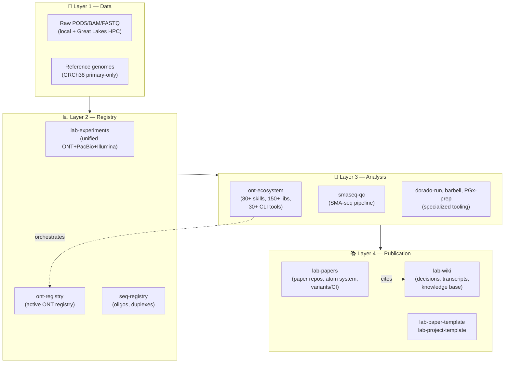

# Single Molecule Sequencing

**Long-read genomics, pharmacogenomics, and methods development at the [Athey Lab](https://atheylab.org), University of Michigan**

---

## 🔬 What we do

We build **single-molecule, long-read sequencing methods** — Oxford Nanopore Technologies (ONT) and PacBio HiFi — to attack genomic problems that short-read sequencing cannot solve cleanly: structural variation in pharmacogenes (CYP2D6 / CYP2D7 / CYP2D8P), ssDNA size distribution at single-base resolution, repeat expansions, methylation aging clocks, and Cas9-targeted enrichment QC.

Our codebase is organized as a **four-tier infrastructure stack** (data → registry → analysis → publication) that lets every published claim trace back to raw reads through a versioned, reproducible pipeline. The org hosts 12 repositories (12 public · 0 private · 1 archived) covering ~0 active manuscripts, ~1 project shells, and the analysis frameworks they share.

## 🚀 Quick links — dashboards & live sites

- **[🌐 Athey Lab Website](https://atheylab.org)** — Public-facing lab homepage: people, publications, news.
- **[📚 SMS Textbook (Web Edition)](https://single-molecule-sequencing.github.io/sms-textbook-web/)** — 8-volume Quarto book on Single-Molecule Sequencing for Pharmacogenomics — 349 chapters, fully searchable.
- **[🧬 ont-ecosystem Docs](https://single-molecule-sequencing.github.io/ont-ecosystem/)** — Skill catalog and CLI reference for the lab's primary analysis framework (153 lib modules, 80+ skills).
- **[🧪 Sample-Sheet Generator](https://single-molecule-sequencing.github.io/sss/)** — Browser-based wet-lab sample-sheet builder for ONT runs.
- **[🏠 Org Landing](https://single-molecule-sequencing.github.io/)** — Org-level Pages site with live pulse, paper portfolio, and project knowledge graph.

## 🏗️ Lab infrastructure stack

The four-tier stack lets every paper trace its claims back to raw reads
through a registry and a reproducible analysis pipeline.

## 📦 Repositories

Every active and archived repo in the org, grouped by purpose. Stamps reflect last `git push` time.

🧭 Marker legend

| Marker | Meaning |
|---|---|
| 🟢 | Active this week |
| 🟡 | Active this month |
| 🟠 | Active in the last 6 months |
| ⚪ | Quiet (>6 months) |
| 🌍 public | Open to the world |
| 🔒 private | Members of `Single-Molecule-Sequencing` only |
| 🏛️ internal | UM enterprise-internal |
| 🔗 site | Has a live GitHub Pages or external homepage |

### 🧪 Active project workspaces

Project-coordination shells (`.project/` + `CLAUDE.md` pattern). Each wraps wet-lab + dry-lab work toward a single research question.

| Repo | Description | Meta |
|---|---|---|
| 🟢 [`longevity-platform-grant`](https://github.com/Single-Molecule-Sequencing/longevity-platform-grant) | Multi-PI longevity grant project: 4-axis long-read sequencing platform (methylation aging clock, somatic mosaicism, PGx of aging, mtDNA heteroplasmy). 14+ PDF variants for R01/R21/NIA/U19/Astera/Impetus/Hevolution/NSF/AFAR/Hillblom/CPRIT | 🌍 public · `Python` |

### 🔧 Wet-lab and analysis tooling

Specialized utilities — basecallers, demultiplexers, sample-sheet generators, reference builders, fragment viewers.

| Repo | Description | Meta |
|---|---|---|
| 🟢 [`dorado-run`](https://github.com/Single-Molecule-Sequencing/dorado-run) | ONT Dorado basecaller Orchestration Pipeline | 🌍 public · `Python` |
| 🟢 [`ONT-SMA-seq`](https://github.com/Single-Molecule-Sequencing/ONT-SMA-seq) | The SMA-seq workflow for Oxford Nanopore Technology, in pure Python and SQLite database. | 🌍 public · `Python` |
| 🟢 [`End_Reason_nf`](https://github.com/Single-Molecule-Sequencing/End_Reason_nf) | Nextflow pipeline implementing the end-reason QC workflow. | 🌍 public · `Nextflow` |
| 🟢 [`sss`](https://github.com/Single-Molecule-Sequencing/sss) · [🔗 site](https://single-molecule-sequencing.github.io/sss/) | Sequencing sample sheet generator for wet lab | 🌍 public · `HTML` |
| 🟠 [`CypScope-prep`](https://github.com/Single-Molecule-Sequencing/CypScope-prep) | Preparatory FastQ extraction and alignment on per-sample BAM files for CypScope | 🌍 public · `Python` |
| 🟠 [`barbell`](https://github.com/Single-Molecule-Sequencing/barbell) | Extremely fast and accurate Nanopore demultiplexing | 🌍 public · `Rust` |
| 🟠 [`dorado-bench`](https://github.com/Single-Molecule-Sequencing/dorado-bench) | A benchmarking effort of various doraro models for the SMS pipeline | 🌍 public · `Python` |
| 🟠 [`PGx-prep`](https://github.com/Single-Molecule-Sequencing/PGx-prep) | Preparatory demultiplex algorithms and HPC+Slurm solutions on BAM files for the ONT PGx workflow | 🌍 public · `Python` |

### 🌐 Websites and documentation

Public-facing landing pages and documentation sites built with Jekyll, Quarto, or static HTML.

| Repo | Description | Meta |
|---|---|---|
| 🟢 [`single-molecule-sequencing.github.io`](https://github.com/Single-Molecule-Sequencing/single-molecule-sequencing.github.io) · [🔗 site](https://single-molecule-sequencing.github.io/) | Org-level GitHub Pages site (Jekyll). | 🌍 public · `Python` |

📦 Archived repositories (1)

### Archived

Preserved for git history; superseded by newer canonical repos.

| Repo | Description | Meta |
|---|---|---|
| 🟠 [`CypScope`](https://github.com/Single-Molecule-Sequencing/CypScope) | ONT sequencing read coverage report tool over CYP2D6, CYP2D7, and CYP2D8P regions | 🌍 public · `JavaScript` |

🧹 Scratch / vendored / smoke-test (1)

### Scratch

Auto-spawned smoke-test repos, vendored third-party tools, demo content.

| Repo | Description | Meta |
|---|---|---|
| ⚪ [`spec-kit`](https://github.com/Single-Molecule-Sequencing/spec-kit) | 💫 Toolkit for Spec-Driven Development (vendored). | 🌍 public · `Python` |

---

## 👥 People

The Single-Molecule-Sequencing org is the GitHub home of the **Athey Lab** at the University of Michigan, led by Brian D. Athey (PI). Active members include Greg Farnum, Monica Wolfe, Henry Li, Yisang Kim, Mingze Sun, Souma Mahapatra, Isaac Farnum, and Amber Walker. See the [Athey Lab People page](https://atheylab.org/people/) for the full roster.

## 📬 Contact

- **Lab email:** atheylab-sequencing@umich.edu
- **PI:** Brian D. Athey · bleu@umich.edu
- **Address:** Med Sci Building 1, 1301 Catherine St, Ann Arbor MI 48109
- **Bug reports / issues:** Open an issue in the relevant repo, or email the lab address above.

## 📊 Org stats

- **Total repositories:** 12
- **Public:** 12 · **Private:** 0 · **Internal:** 0 · **Archived:** 1
- **Active manuscripts:** 0
- **Active project workspaces:** 1

---

This page is auto-generated daily by the
[`/org-readme`](https://github.com/Single-Molecule-Sequencing/ont-ecosystem/tree/main/skills/org-readme) skill
running in <a href="https://github.com/Single-Molecule-Sequencing/.github/blob/master/.github/workflows/update-org-readme.yml"><code>update-org-readme.yml</code></a>.
Last regenerated: <code>2026-05-08</code>.
_Note: 1 link(s) flagged as unreachable in this run; they were dropped from Quick Links._

